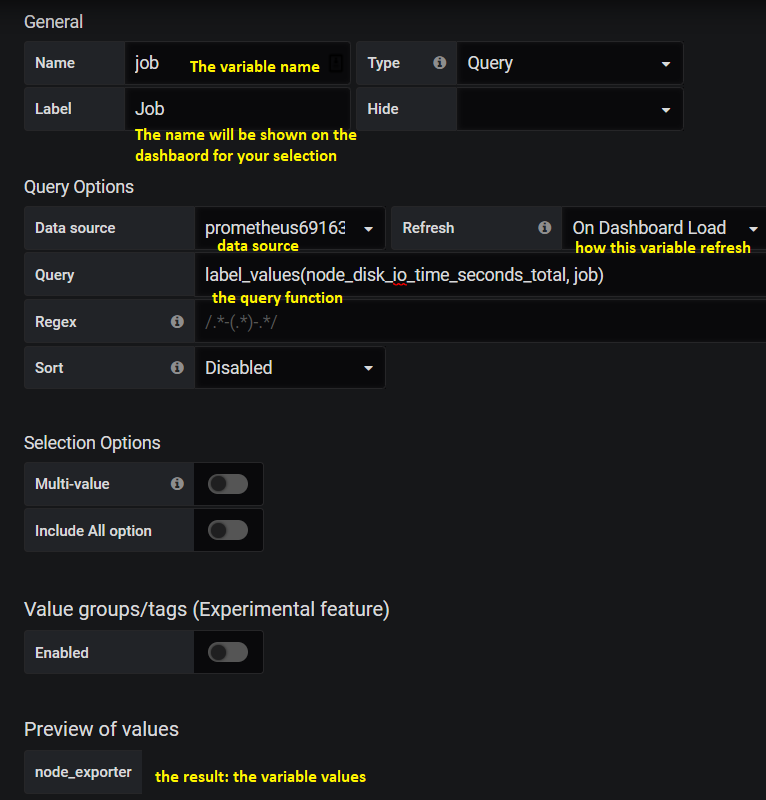
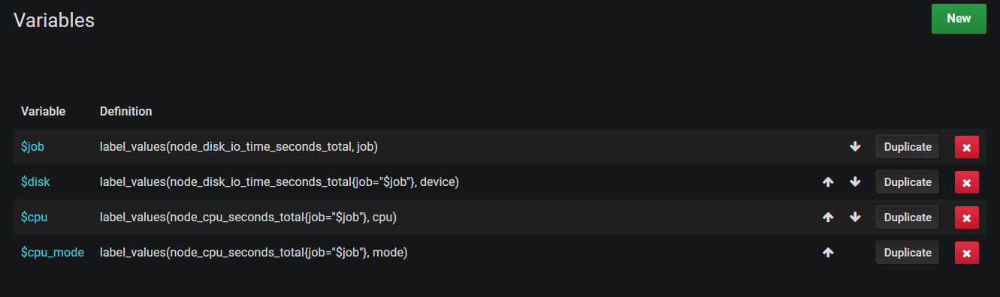

Grafana Dashboard
===================

This chapter will cover the knowledge on how to create Grafana dashboards to showcase metrics scraped by Prometheus.

Grafana Deployment
-------------------

First thing first, we need to have a running Grafana server before creating any dashboard.

The Grafana deployment is pretty easy, and the official document is wonderful. E.g., to deploy Grafana on CentOS, the official `Install on RPM-based Linux <https://grafana.com/docs/grafana/latest/installation/rpm/>`_ is good enough to kick started the installation. For other OSs, similar documents can be found from the same page. We won't provide any words on the installation any more.

Understand Prometheus Metrics
------------------------------

Before moving forward, we need to have basic understanding on how metrics look like from the perspective of exporters and Prometheus. We are going to show this idea by using the node_exporter we previously deployed in a previous chapter.

Exporter Metrics
~~~~~~~~~~~~~~~~~

Metrics collected by an exporter (node_exporter in this chapter) are as below:

.. image:: images/exporter_data.png

Let's explain the metrics (counter, gauge, etc., refer to `Metrics Types <https://prometheus.io/docs/concepts/metric_types/>`_) with **node_disk_io_time_seconds_total** as an example:

- Each metric has a name, in this example, its name is node_disk_io_time_seconds_total;
- A metric may have some labels associated with it to distinguish its instances. In this example, node_disk_io_time_seconds_total has only one label "device". Based on the label values, instances can be differentiated easily - this is important for data filter;
- Metrics will be collected from exporters but won't be saved on exporters.

Prometheus Metrics
~~~~~~~~~~~~~~~~~~~

Metrics scraped by Prometheus from an exporter (node_exporter in this chapter) are as below:

Let's explain the differences with the same metric **node_disk_io_time_seconds_total**:

- Query/Filter can be executed for all metrics supported by exporters. In this example, node_disk_io_time_seconds_total is a metric scraped from a node_exporter, hence we can query it from Prometheus directly;
- Beside the labels provided by an exporter (as above), Prometheus will add several more labels. In this example, 2 x labels are added: instance, job:

  - instance: this label is added to all exporters. It is the same as the **targets** configured for a scrape job;
  - job: this label is added to all exporters. It is the same as the job name as defined in prometheus.yml;
  - Additional labels can be added. Refer to `static_config and relabel_config <https://prometheus.io/docs/prometheus/latest/configuration/configuration/#static_config>`_

- Advanced queries/filters can be achieved through the use of `PromQL <https://prometheus.io/docs/prometheus/latest/querying/basics/>`_.

Add Data Source
----------------

Grafana is only responsible for displaying time series metrics as graphs(within panels), it does not store metrics but retrieve metrics from data sources. Before using Grafana, the first step is adding at least a data source.

Grafana can use quite a lot systems as data sources, including Prometheus (our focus), Graphite, InfluxDB, etc. It is easy to add a data source: **Configuaration->Data Sources->Add Data Srouce->Prometheus->Input Inforamtion->Save & Test->Done**

Create Dashabord
-----------------

Grafana organizes panels(each panel containing a graph) as dashboards. In other words, a dashboard is the container for holding graphs(within panels) - hence a dashboard need to be created before adding any graph. The creation of a dashboard is straightfoward: **Create->Dashboard**

**Notes:** Remember to save changes by clicking **Save dashboard** on the up right corner. Otherwise, your customization effort will be lost.

Varaiables
~~~~~~~~~~~

Dashboards have some special settings. The most important one is **Variables**. By defining variables, we can control the behavior of graphs within a dashboard flexibly but not hard coded.

Well defined variables should focus on extracting label values from metrics' labels, and graphs (panels) can leverage these to distinguish jobs, instances, metrics, etc. The most important builtin functions for this is **label_values**. We will cover the most common usage in this section, for knowledge not covered here, please refer to `Query variable <https://grafana.com/docs/grafana/latest/features/datasources/prometheus/#query-variable>`_.

Once varaibles are defined, they can be shown as choices (single or multiple selection) and graphs will change dynamically based on your chocies.

label_values
~~~~~~~~~~~~~

label_values is the funcition used to grab the value(s) of label(s) and turn the result into Grafana varaibles. Let's expain it with examples:

1. We have a metric from Prometheus as below:

   ::

     node_disk_io_time_seconds_total{device="dm-0",instance="10.226.68.144:9100",job="node_exporter"}
     node_disk_io_time_seconds_total{device="dm-1",instance="10.226.68.144:9100",job="node_exporter"}
     node_disk_io_time_seconds_total{device="sda",instance="10.226.68.144:9100",job="node_exporter"}
     node_disk_io_time_seconds_total{device="sdb",instance="10.226.68.144:9100",job="node_exporter"}
     ......

#. If we want to extract the job name from the job label, we can call label_values as below:

   ::

     label_values(node_disk_io_time_seconds_total, job)

   The result will be simply "node_exporter"

#. If we want to extract the device name from the "device" label:

   ::

     label_values(node_disk_io_time_seconds_total, device)

   The result will be a list ["dm-0", "dm-1", ..., "sda", "sdb", ...]

Define Variables
~~~~~~~~~~~~~~~~~

To define variables: Select the dashboard->Dashboard settings->Variables->Add variable. The configuration page as below will be shown:

Once such a variable is defined and saved, a selection on the dashboard will be shown as below:

.. image:: images/grafana_variable_dashboard1.png

**Variable Reference**

We can refer to existing varaibles when we define new variables. E.g., we have defined a variable named "job", then we can refer to it while we define new variable "disk" as below:

.. image:: images/grafana_variable_refer.png

Please make sure referred to variables should be defined before varaibles who refer to them.

**Multi-value and All**

There are options as below while defining varaibles:

- Multi-value
- Include All option

They are mainly used for repeat operation. The behavior for them is as below:

1. Let's say we have below metrics:

   ::

     node_disk_io_time_seconds_total{device="dm-0",instance="10.226.68.144:9100",job="node_exporter"}
     node_disk_io_time_seconds_total{device="dm-1",instance="10.226.68.144:9100",job="node_exporter"}
     node_disk_io_time_seconds_total{device="sda",instance="10.226.68.144:9100",job="node_exporter"}
     node_disk_io_time_seconds_total{device="sdb",instance="10.226.68.144:9100",job="node_exporter"}
     ......

#. We have defined variable "job" and "disk" as below with label_values:

   ::

     label_values(node_disk_io_time_seconds_total, job)
     label_values(node_disk_io_time_seconds_total{job="$job"}, device)

#. Variable disk returns result as ["dm-0", "dm-1", ..., "sda", "sdb", ...]. By default, only one of them can be selected on the dashboard:

   .. image:: images/grafana_variable_dashboard2.png

#. But when we turn on "Multi-value" and "Include All option", we can select multiple options on the dashboard or select the all option which represent all results:

   .. image:: images/grafana_variable_dashboard3.png

**Extract values based on regular expression**

Most of times, label_values works well extracting what we want. But sometimes, it is not possible to use it. Under such condition, we can use raw PromQL as below:

The tricky thing here is the result is a list of raw PromQL results. If we want to extract what we want, we need to use regular expression to grab them out:

.. image:: images/grafana_variable_re.png

Actually, regular expression also works smoothly with label_values:

Add Panel
~~~~~~~~~~

Once variables have been defined, we can go ahead defining graphs by adding panels. Assume we have define below variables:

**Singlestata**

The most basic graph supported by Grafana is "Singlestat". It is used mainly for simple metric like uptime, cpu usage, etc. Let's explain this with an example.

1. Let's say we have a metric as below, we want to show it as a "Singlestat":

   ::

     node_cpu_seconds_total{cpu="0",instance="10.226.68.144:9100",job="node_exporter",mode="idle"}
     node_cpu_seconds_total{cpu="0",instance="10.226.68.144:9100",job="node_exporter",mode="iowait"}
     node_cpu_seconds_total{cpu="0",instance="10.226.68.144:9100",job="node_exporter",mode="system"}
     node_cpu_seconds_total{cpu="1",instance="10.226.68.144:9100",job="node_exporter",mode="idle"}
     node_cpu_seconds_total{cpu="1",instance="10.226.68.144:9100",job="node_exporter",mode="iowait"}
     node_cpu_seconds_total{cpu="1",instance="10.226.68.144:9100",job="node_exporter",mode="system"}
     ...

#. Add a panel by opening the dashboard->Add a panel: the page is as below, we can add our metric accordingly as the first step:

   .. image:: images/grafana_panel_define1.png

#. Then the "Singlestat" can be selected and the unit can be adjusted:

    .. image:: images/grafana_panel_define2.png

#. The last step can be used to assign a name to the grapha/panel, and the repeat scenario can be set based on defined variables:

   .. image:: images/grafana_panel_define3.png

#. After saving the graph/panel settings, we can see it from the dashboard:

   .. image:: images/grafana_panel_singlestat.png

**Graph**

Graph actually stands for line chart in Grafana. It is used frequently to reflect metric changes. Let's expain it with an example like before.

1. Let's say we have 2 x metrics (node_disk_read_bytes_total, node_disk_written_bytes_total) as below, we want to show them in the same panel as a "Graph":

   ::

     node_disk_read_bytes_total{device="dm-0",instance="10.226.68.144:9100",job="node_exporter"}
     node_disk_read_bytes_total{device="dm-1",instance="10.226.68.144:9100",job="node_exporter"}
     ......
     node_disk_written_bytes_total{device="dm-0",instance="10.226.68.144:9100",job="node_exporter"}
     node_disk_written_bytes_total{device="dm-1",instance="10.226.68.144:9100",job="node_exporter"}
     ...

#. Add a panel and add our metrics: we define 2 x metrics here:

   .. image:: images/grafana_panel_multimetrics1.png

#. Select "Graph" as the visualization type and transform the data display (metric 1(Read) above y=0 and metric 2(Write) below y=0, this is not required but just a trick):

   .. image:: images/grafana_panel_multimetrics2.png

#. Define a title and specify the repeating:

   .. image:: images/grafana_panel_multimetrics3.png

#. After saving the changes, we can see the update from the dashboard:

   .. image:: images/grafana_panel_graph.png

#. This is great. However, it is easy to find the lines within the graph are flat which cannot show the change over time. Under such condition, `PromQL functions <https://prometheus.io/docs/prometheus/latest/querying/functions/>`_ can be used to achieve the goal:

   .. image:: images/grafana_panel_graph_promqlfunc.png

Grouping and Group Repeating
------------------------------

While more and more panels are being added onto a dashboard, we need a mechanism to group them based on logical or other criterias in order to quick focus on the metrics we care about. In the meanwhile, we also need the functionality to repeat a set of panels over some higher level variables.

For example, we have a metric as below:

::

  node_cpu_seconds_total{cpu="0",instance="10.226.68.144:9100",job="node_exporter",mode="idle"}
  node_cpu_seconds_total{cpu="0",instance="10.226.68.144:9100",job="node_exporter",mode="iowait"}
  node_cpu_seconds_total{cpu="0",instance="10.226.68.144:9100",job="node_exporter",mode="irq"}
  ......
  node_cpu_seconds_total{cpu="1",instance="10.226.68.144:9100",job="node_exporter",mode="idle"}
  node_cpu_seconds_total{cpu="1",instance="10.226.68.144:9100",job="node_exporter",mode="iowait"}
  node_cpu_seconds_total{cpu="1",instance="10.226.68.144:9100",job="node_exporter",mode="irq"}
  ......

With the knowledge we learned from the previous sections, we are already able to "repeat" panels based on a single label like "cpu" or "mode". But how we can repeat the same for multiple labels together (repeat over both "cpu" and "mode" labels)?

Grafana supports the requirements through the use of **Row**, which is used to group panels and repeat such groups based on a variable. When **Row** repeat is used together with the normal repeat option of a **Panel**, we can achieve our goal to repeat a panel over multiple labels at the same time.

It is straightforward to use the feature:

1. Check our previously defined variable "cpu":

   .. image:: images/grafana_variable_cpu.png

#. Check our previously defined variable "cpu_mode" and make it supports multiple selection:

   .. image:: images/grafana_variable_cpumode.png

#. Select the dashboard->Add panel-> Covert to row->Unfold the row;
#. Add panel again, and drag the new panel into the Row: panels get organized into groups;
#. For the newly created panel, click "Add Query" and define it as below:

   .. image:: images/grafana_variable_cpumoderepeat.png

#. After saving, we have a Row as below:

   .. image:: images/grafana_rowsingle.png

#. Fold the Row object, then itself can be dragged up/down by clicking the right end of the Row object;
#. Hover the mouse over the Row object, then click settings. Here, we can assign a name and select the varaible we want to repeat the group of panels based on (cpu here):

   .. image:: images/grafana_dashboard_row1.png

#. Save the changes and refresh the dashboard. After selecting multiple CPU (or "ALL"), we get our dashboard changed automatically as below:

   .. image:: images/grafana_rowrepeat.png

#. Done! It is time for you to practice.

Save Dashboard Settings
------------------------

A dashboard can be described as a JSON document, hence it can be saved, shared and resotred easily. To export a dashboard: select the dashboard->Share dashboard->Eport->Save to file.

Reference
-----------

- `Query Prometheus <https://prometheus.io/docs/prometheus/latest/querying/basics/>`_
- `Grafana Templating Variables <https://grafana.com/docs/grafana/latest/reference/templating/>`_
- `Using Prometheus in Grafana <https://grafana.com/docs/grafana/latest/features/datasources/prometheus/>`_
- `Great PromQL Examples with Diagrams <https://timber.io/blog/promql-for-humans/>`_
