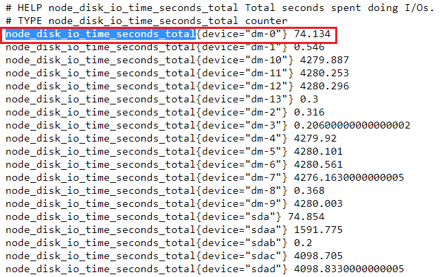
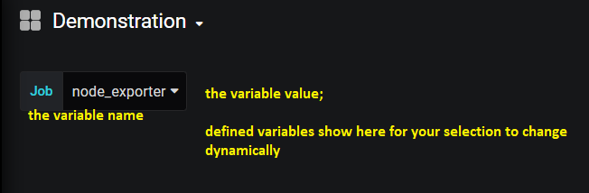
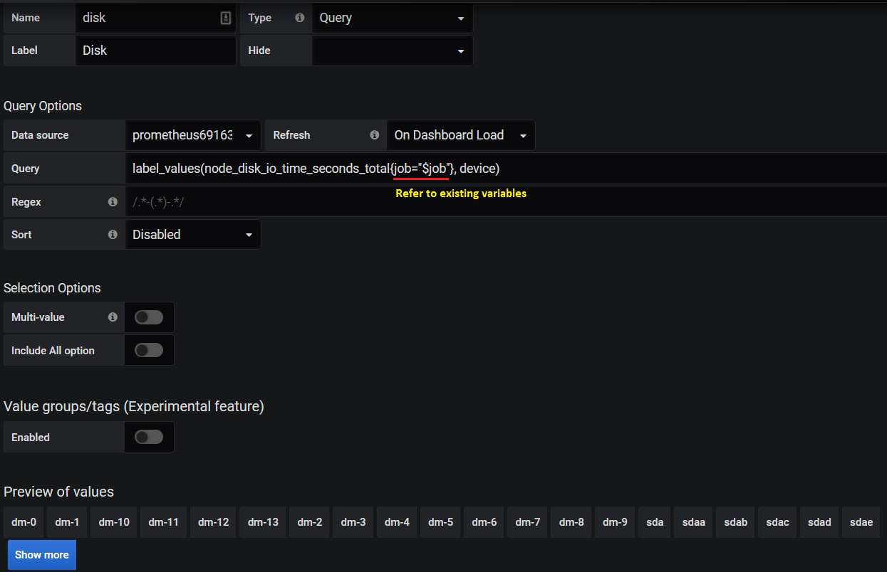
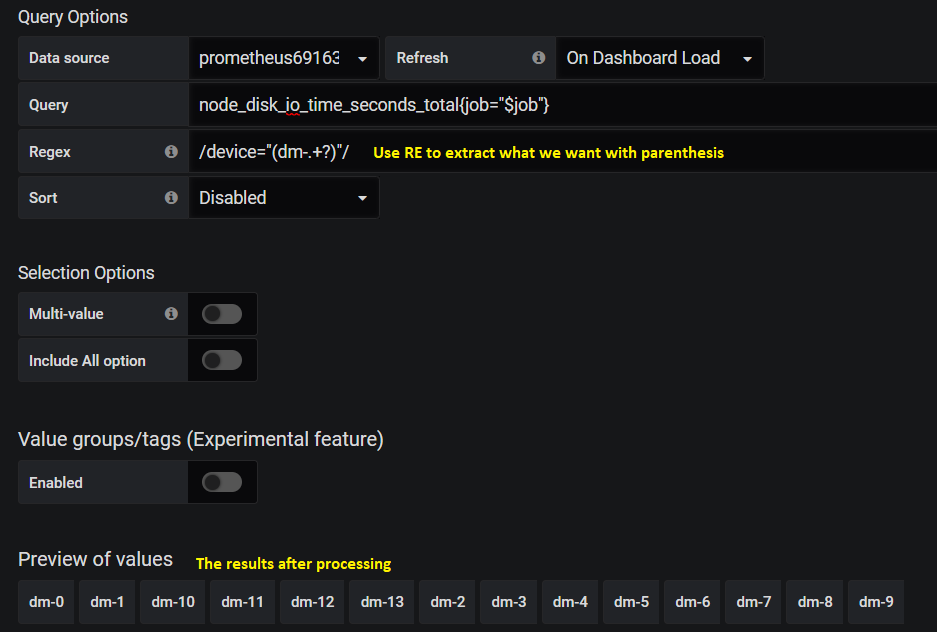

Grafana Dashboard
===================

This chapter will cover the knowledge on how to create Grafana dashboards.

How all the stuff works?
----------------------------

Before moving forward, we should understand the relationshipt of Prometheus exporters, Prometheus, and Grafana.

- Prometheus exporters are responsible for collecting performance stats from monitored devices. They work as standalone apps running close to or even on the targets. The Prometheus company or users can implement their own exporters based on their requirements. There exist quite a few exporters for use directly, refer `here <https://prometheus.io/docs/instrumenting/exporters/>`_
- Prometheus itself does not collect data from monitored devices directly, instead, it collects (called **scrape** by Prometheus) data from enabled exporters (based on configuration file prometheus.yml) and save the data locally into the **./data** directly or remotely to a database (such as InfluxDB).
- Grafana leverages Prometheus as a data source and showcases the data based on user defined dashboards.

**Notes:**

- Exporters only scrape data from monitored devices, they won't save data;
- Prometheus scraps data from exporters and save the data centraly. Advanced queries against the data are supported by Prometheus through PromQL;
- Grafana leverages PromQL and its builtin query functions to filter data and display them on dashboards;
- Grafana uses Prometheus as a kind of data source, and also support quite a lot other data sources such as ELK, InfluxDB, etc.

Undetstand Prometheus Data
----------------------------

Exporter Data
~~~~~~~~~~~~~~~

Data scraped by exporters are as below:

Let's explain the data based on the metric (counter, gauge, etc., refer to `Metrics Types <https://prometheus.io/docs/concepts/metric_types/>`_) **unity_basic_reads**:

- Each metric has a name, in this example, its name is unity_basic_reads;
- An metric may have some labels associated with it to distinguish its instances. In this example, unity_basic_reads has 2 x lables: sp, unity. Based on the label values, instances can be differentiated easily - this is important for data filter;
- Metrics will be scraped based on the interval configured for exporters, but they won't be saved.

Prometheus Data
~~~~~~~~~~~~~~~~~

Data scraped by Prometheus from exporters are as below:

.. images:: images/prometheus_data.png

Let's explain the data based on the same metric **unity_basic_reads**:

- Query/Filter can be executed for all metrics supported by exporters. In this example, unity_basic_reads is a metric scraped from an exporter, hence we can query it from Prometheus directly;
- Beside the labels provided by an exporter (as above), Prometheus will add several more lables. In this example, 2 x lables are added: instance, job:

  - instance: this label is added to all exporters. It is the same as the **targets** configured for a scrape job;
  - job: this lable is added to all exporters. It is the same as the job name as defined in prometheus.yml;
  - Additional labels can be added. Refer to `static_config and relabel_config <https://prometheus.io/docs/prometheus/latest/configuration/configuration/#static_config>`_

- Advanced queries/filters can be achieved through the use of `PromQL <https://prometheus.io/docs/prometheus/latest/querying/basics/>`_.

Add Data Source
----------------

Grafana is only responsible for displaying time series data as graphs(within panels), it does not store data but retrieve data from data sources. Before using Grafana, the first step is adding at least a data source.

Grafana can use quite a lot systems as data sources, including Prometheus (our focus), Graphite, InfluxDB, etc. It is easy to add a data source: **Configuaration->Data Sources->Add Data Srouce->Prometheus->Input Inforamtion->Save & Test->Done**

Create Dashabord
-----------------

Grafana organizes panels(each panel containing a graph) as dashboards. In other words, a dashboard is the container for holding graphs(within panels) - hence a dashabord need to be created before adding any graph. The creation of a dashboard is straightfoward: **Create->Dashboard**

**Notes:** Remember to save changes by clicking **Save dashboard** on the up right corner. Otherwise, your customization effort will be lost.

Varaiables
~~~~~~~~~~~

Dashboards have some special settings. The most important one is **Variables**. By defining variables, we can control the behavior of graphs within a dashboard flexibly but not hard coded.

Well defined variables should focus on extrating label values from metrics' labels, and graphs (panels) can leverage these to distinguish jobs, instances, metrics, etc. The most important builtin functions for this is **label_values**. We will cover the most common usage in this section, for knowledge not covered here, please refer to `Query variable <https://grafana.com/docs/grafana/latest/features/datasources/prometheus/#query-variable>`_.

Once varaibles are defined, they can show as choices (single or multiple selection) and graphs will change dynamically based on your chocies.

label_values
~~~~~~~~~~~~~

label_values is the funcition used to grab the value(s) of label(s) and turn the result into Grafana varaibles. Let's expain it with examples:

1. We have a metric from Prometheus as below:

   ::

     unity_basic_reads{instance="10.226.68.185:9001",job="unity_exporter",sp="spa",unity="uni4235"}
     unity_basic_reads{instance="10.226.68.185:9001",job="unity_exporter",sp="spb",unity="uni4235"}

#. If we want to extract the job name from the job label, we can call label_values as below:

   ::

     label_values(unity_basic_reads, job)

   The result will be simply "unity_exporter"

#. If we want to extract the sp name from the sp label:

   ::

     label_values(unity_basic_reads, sp)

   The result will be a list ["spa", "spb"]

#. If we want to extract the unity name from the unity label:

   ::

     label_values(unity_basic_reads{sp="spa"}, unity)

Define Variables
~~~~~~~~~~~~~~~~~

To define variables: Select the dashboard->Dashboard settings->Variables->Add variable. The configuration page as below will be shown:

.. image:: images/grafana_variable_define.png

Once such a variable is defined and saved, a selection on the dashboard will show as below:

**Variable Reference**

While defining variables, we can refer to existing varaibles. E.g., we have defined a variable named "job", then we can refer to it while defining variable "sp" as below:

Please make sure referred to variables should be defined before varaibles who refer to them.

**Multi-value and All**

There are options as below while defining varaibles:

- Multi-value
- Include All option

They are mainly used for repeat operation. The behavior for them is as below:

1. Let's say we have below metrics:

   ::

     unity_basic_reads{instance="10.226.68.185:9001",job="unity_exporter",sp="spa",unity="uni4235"}
     unity_basic_reads{instance="10.226.68.185:9001",job="unity_exporter",sp="spb",unity="uni4235"}

#. We have defined variable "job" and "sp" as below with label_values:

   ::

     label_values(unity_basic_reads, job)
     label_values(unity_basic_reads{job="$job"}, sp)

#. Variable sp returns result as ["spa", "spb"] normally and only one of them can be selected on the dashboard:

   .. image:: images/grafana_variable_dashboard2.png

#. But when we turn on "Multi-value" and "Include All option", we can select multiple options on the dashboard or select the all option which represent all results:

   .. image:: images/grafana_variable_dashboard3.png

**Extract values based on regular expression**

Most of times, label_values works well extracting what we want. But sometimes, it is not possible to use it. Under such condition, we can use raw PromQL as below:

.. image:: images/grafana_variable_promql.png

The tricky thing here is the result is a list of raw PromQL results. If we want to extract what we want, we need to use regular expression to grab them out:

Add Panel
~~~~~~~~~~

Once variables have been defined, we can go ahead defining graphs by adding panels. Assume we have define below variables:

.. images:: images/grafana_variable_demo.png

**Singlestata**

The most basic graph supported by Grafana is "Singlestat". It is used mainly for simple metric like uptime, cpu usage, etc. Let's explain this with an example.

1. Let's say we have a metric as below, we want to show it as a "Singlestat":

   ::

     unity_cpu_uptime{instance="10.226.68.185:9001",job="unity_exporter",sp="spa",unity="uni4235"}
     unity_cpu_uptime{instance="10.226.68.185:9001",job="unity_exporter",sp="spb",unity="uni4235"}

#. Add a panel by opening the dashboard->Add a panel: the page is as below, we can add our metric accordinlyg as the first step:

   .. image:: images/grafana_panel_define1.png

#. Then the "Singlestat" can be selected and the unit can be adjusted:

    .. image:: images/grafana_panel_define2.png

#. The last step can be used to assign a name to the grapha/panel, and the repeat scenario can be set based on defined varialbes:

   .. image:: images/grafana_panel_define3.png

#. After saving the graph/panel settings, we can see it from the dashboard:

   .. image:: images/grafana_panel_singlestat.png

**Graph**

Graph actually stands for line chart in Grafana. It is used frequently to reflect metric changes. Let's expain it with an example like before.

1. Let's say we have 2 x metrics as below, we want to show them in the same panel as a "Graph":

   ::

     unity_basic_reads{instance="10.226.68.185:9001",job="unity_exporter",sp="spa",unity="uni4235"}
     unity_basic_reads{instance="10.226.68.185:9001",job="unity_exporter",sp="spb",unity="uni4235"}
     unity_basic_writes{instance="10.226.68.185:9001",job="unity_exporter",sp="spa",unity="uni4235"}
     unity_basic_writes{instance="10.226.68.185:9001",job="unity_exporter",sp="spb",unity="uni4235"}

#. Add a panel and add our metrics: we define 2 x metrics here:

   .. image:: images/grafana_panel_multimetrics1.png

#. Select "Graph" as the visualization type and transform the data display (metric 1(Read) above y=0 and metric 2(Write) below y=0, this is not required but just a trick):

   .. image:: images/grafana_panel_multimetrics2.png

#. Define a title and specify the repeating:

   .. image:: images/grafana_panel_multimetrics3.png

#. From the dashboard, we can see the update:

   .. image:: images/grafana_panel_graph.png

Grouping and Group Repeating
------------------------------

While more and more panels are being added onto a dashboard, we need a mechanism to group them based on logical or other criterias in order to quick focus on the metrics we care about. In the meanwhile, we also need the functionality to repeat a set of panels over some higher level variables.

For example, we have below metrics from 2 x different Unity boxes:

::

  unity_basic_reads{instance="10.226.68.185:9001",job="unity_exporter",sp="spa",unity="uni4235"}
  unity_basic_reads{instance="10.226.68.185:9001",job="unity_exporter",sp="spb",unity="uni4235"}
  unity_basic_reads{instance="10.226.68.185:9001",job="unity_exporter",sp="spa",unity="uni4236"}
  unity_basic_reads{instance="10.226.68.185:9001",job="unity_exporter",sp="spb",unity="uni4236"}

With the knowledge we learned from the previous sections, we are already able to "repeat" panels based on the "sp" label for the same Unity box. But how we can repeat the same for multiple Unit boxes (the "unity" label)? In other words, we want the same panels for uni4235 repeat automatically for uni4236.

Grafana supports the requirements through the use of **Row**, which is used to group panels and repeat such groups based on variables.

It is straightforward to use the function:

1. Select the dashboard->Add panel-> Covert to row;
#. Unfold the Row object, then drag panels into/outof the Row: panels get organized into groups;
#. Fold the Row object, then itself can be dragged up/down by clicking the right end of the Row object;
#. Hover the mouse over the Row object, then click settings. Here, we can assign a name and select the varaible we want to repeat the group of panels based on:

   .. image:: images/grafana_dashboard_row1.png

#. Done!

Save Dashboard Settings
------------------------

A dashboard can be described as a JSON document, hence it can be saved, shared and resotred easily. To export a dashboard: select the dashboard->Share dashboard->Eport->Save to file.

Reference
-----------

- `Query Prometheus <https://prometheus.io/docs/prometheus/latest/querying/basics/>`_
- `Grafana Templating Variables <https://grafana.com/docs/grafana/latest/reference/templating/>`_
- `Using Prometheus in Grafana <https://grafana.com/docs/grafana/latest/features/datasources/prometheus/>`_
