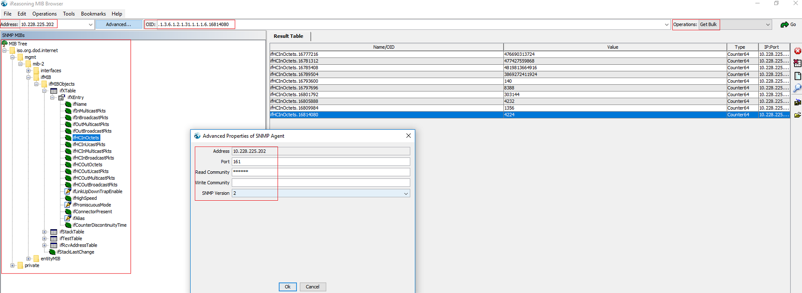

SNMP Exporter for Network Equipement
======================================

Prometheus provides an official SNMP exporter, A.K.A snmp_exporter, which can be used for monitoring devices which support SNMP, such as switches, routers, firewall, etc.

This chapter will cover all ideas on how to enable snmp_exporter for monitoring switches only. For other devices which support SNMP, the enablement process is common.

SNMP Introduction
-------------------

SNMP, the acronym for **Simple Network Mangement Protocl**,  is an application–layer protocol defined by the Internet Architecture Board (IAB) in RFC1157 for exchanging management information between network devices. It is a part of TCP/IP protocol suite.

Its main usage focus on collecting and organizing information about managed devices on IP networks and for modifying that information to change device behavior. Devices that typically support SNMP include cable modems, routers, switches, servers, workstations, printers, and more.

**Notes:** This document only shares the most basic knowledge on SNMP, for detailed in-depth information, please leverage google or read books.

Main Components
~~~~~~~~~~~~~~~~

SNMP consist of:

- SNMP Manager
- SNMP Agent
- MIB

SNMP Manager
+++++++++++++

A SNMP manager or management system is responsible to communicate with the SNMP agent implemented network devices. This is typically a computer that is used to run one or more network management systems (NMS). The key functions are as below:

- Query agents
- Set variables in agents
- Get notifications from agents

SNMP Agent
+++++++++++

A SNMP agent is a program that is packaged within the managed devices. Enabling agents allow agents collect the management information databases from the managed devices locally and make them available to the SNMP manager during query. These agents could be standard (e.g. Net-SNMP) or specific to a vendor (e.g. HP insight agent).

The key functions of a SNMP agent is as below:

- Collect management information locally on managed devices
- Stores and retrieves management information as defined in the MIB
- Signals an event to the manager

MIB
++++

MIB is short for Management Information Base, which describes the managed device parameters, such as port status, througput, etc. The SNMP manager uses this database to request the agent for specific information and further translates the information as needed for the Network Management System (NMS).

Typically these MIB contains standard set of statistical and control values defined for hardware nodes on a network. SNMP also allows the extension of these standard values with values specific to a particular agent through the use of **private MIBs**.

MIB is organized as a well defined tree structure with each leaf stands for a specific object of the managed device, which is referred as **Object Identifier (OID)**. Each OID is unique and can be located from the root of the MIB tree with an address like .1.1.2.3.x.x.x. For common frequently used OIDs, human friendly names will be assigned/mapped to the number dot address, e.g., "sysDescr" is the same as ".1.3.6.1.2.1.1.1", which is defined by RFC1213 .

.. image:: images/mib_tree.png

**OID Details**

We need to have a good understanding on what each OID stands for when SNMP is used for monitoring because some calculation work may be needed for collected stats - we need understand the unit, the meaning, etc.. This task can be done with the help of MIB browser and http://oidref.com/.

Let's take a look at the below example:

1. OID **IfHCInOctets** is collected, we want to understand what it stands for;
#. MIB browser will show a short description on the OID once clicked:

   .. image:: images/oid_mibdesc.png

#. More detailed information can be gotten with oidref:

   .. image:: images/oid_refdesc.png

After understanding the OID thoroughly, we can do calculations. E.g., IfHCInOctets unit is byte, then we can translate it into KB, MB, etc.

SNMP Versions
~~~~~~~~~~~~~~~

There are 3 versions of SNMP protocol:

- SNMPv1
- SNMPv2 (SNMPv2c, SNMPv2u)
- SNMPv3

The main differences focus on security. Simply speaking, SNMPv1 is not secure enough, SNMPv3 is too strict, hence SNMPv2 are the most popular adopted deployment.

Community String
+++++++++++++++++

A SNMP manager needs to talk to a SNMP agent to work, so a mechanism to protect the connection is required. Community based or user based authentication can be used for the purpose.

Community string is the most straightfoward method for authentication if SNMPv2c is used. Its implementation is quite simple: a string is defined as a kind of password on SNMP agents, and SNMP manger queries agents by providing the correct string for authentication.

SNMP can be used to query agents, and also can be leveraged to set variables to change something (e.g., online/offline a port). The community string provides READ and WRITE capability accordingly:

- READ ONLY: also referred as "public community string", and the default value is "public" for most managed devices once SNMP agents are enabled. It can only be used to query MIB inforamtion;
- READ WRITE/WRITE: also referred as "private community string", and this is not enabled/set by default. It can be used to change object status, such as reboot, port online/offline, etc.

Poll and Trap
~~~~~~~~~~~~~~

SNMP supports 2 ways to get infromation from MIB:

- Poll: Poll is triggered from SNMP managers, which send queries to SNMP agents on managed devices, which listen at UDP port 161. Each poll is a synchronous opeartion, BTW.
- Trap: Instead of performing queries from SNMP managers, trap is a mechanism to let SNMP agents send asynchronous events to SNMP mangers directly. With this scenario, SNMP managers listen at UDP port 162 for agent connections, and may take actions following the events (ack, etc.).

Poll Commands
~~~~~~~~~~~~~~~

SNMP ships very simple commands to support queries to MIB. The most frequently used commands are as below:

- GET: retrieve information on one specified OID
- GET NEXT: retrieve information on the next OID
- GET BULK: retrive inforamtion for a group of OIDs which share similar features
- WALK: actully WALK is not a SNMP command, but just a wrapper of GET NEXT. It is used to get information from a tree of OIDs.

MIB Browser
~~~~~~~~~~~~~

Beside network management system (SNMP Manager), a lightweight tool called **MIB Browser** can be leveraged to explore SNMP MIB inforamtion. Below is an overview of a GUI based MIB browser from iReasoning (free to use).

snmp_exporter
---------------

Prometheus provides official SNMP support through snmp_exporter, which consist of:

- exporter: collect metrics from managed devices through SNMP, acts as a NMS;
- generator: create configurations for exporter by mapping SNMP OIDs to counters, gauges which can be understood by Prometheus;

This document will cover both topics.

generator
~~~~~~~~~~

Simply speaking, generator is the tool parsing SNMP MIBs and creating a configuration file containing specified OIDs which are mapped to indicators of Prometheus. Then exporter queries SNMP agents for those specified OIDs and map the results as counters/gauges based on the configuration file waiting for Prometheus scrapes.

It is not easy to understand the story without an example, so let's do it. By the way, generator can be gotten from `here <https://github.com/prometheus/snmp_exporter/tree/master/generator>`_

Consolidated MIBs
+++++++++++++++++++

The public/standard MIBs(defined by RFC) contain only the basic information (OIDs) for manged devices, which are far more less than expected most of times. Each vendor, such as Cisco, will provide their extended/private MIBs to support more features (OIDs). Such MIBs can be downloaded from vendors' support site. Thanks to open source network manage system (NMS), we do not need to search and download each MIB directly, we can leverage already consolidated MIBs directly from open source NMS.

LibreNMS is such a open source NMS, it consolidates MIBs from all major vendors covering switches, servers, storage, etc. For more informaiton, check `here <https://github.com/librenms/librenms>`_

**The fist step of this example** is getting a copy of these consolidated MIBs, this is easy since it is on github - just clone it. After the download, we can have a check of those MIBs under directory **librenms/mib**: there exists hunders of MIBs, wonderful!

Identify OIDs
++++++++++++++

The goal of using Prometheus is collecting inforamtion we care. For switch, the goal becomes collecting inforamtion for OIDs we are interested in. Before creating the configuration file with generator, we should locate these wanted OIDs.

**In this example, we want to monitor Cisco switch interface throughput and overall processor and memory usage**.

To locate related MIB OIDs, MIB browser is an important tool. In our example, we use the free **iReasoning MIB Browser**. After opening it, some public frequently used MIBs are already loaded automatically.

1. Let's unload all existing MIBs and start from scratch to demonstrace how to perform the task

   .. image:: images/mib_browser_unload.png

#. Let's find the MIBs for switch interface stats

   - Go to http://www.net-snmp.org/docs/mibs/
   - Search **interface**
   - **IF-MIB** pops up

#. Load IF-MIB in MIB browser:

   .. image:: images/mib_browser_ifmib.png

#. After loading IF-MIB, we can see OIDs related with interfaces. But since we want to monitor Cisco switch, if Cisco provides extend/enhanced MIB for IF-MIB, it will be better since much more information can be gotten.
#. Let's google, and **CISCO-IF-EXTENSION-MIB** can be found:

   .. image:: images/mib_browser_ciscoifmib.png

#. Let's load the CISCO-IF-EXTENSION-MIB which is available within librenms/mib/cisco. After loading the MIB, more information about switch interfaces can be seen as below:

   .. image:: images/mib_browser_ciscoifmibinfo.png

#. It is time to find MIBs for CPU and memory stats
#. Again, search CPU and memory with http://www.net-snmp.org/docs/mibs, but this time, no result can be found
#. Let's google "Cisco switch cpu snmp mib" to locate the CPU usage inforamtion at first

   .. image:: images/mib_browser_ciscopmib.png

#. Let's load the MIB **CISCO-PROCESS-MIB** from directory librenms/mib - great, both CPU and memory inforamtion are supported from this MIB:

   .. image:: images/mib_browser_ciscocpumem.png

#. MIBs are ready, let's identify OIDs with the help of MIB browser:

   - Interface related stats:

     - ifEntry: .1.3.6.1.2.1.2.2.1
     - ifXTable: .1.3.6.1.2.1.31.1.1

   - Cisco private MIBs related with interface stats:

     - cieIfPacketStatsEntry

   - CPU and meory related stats:

     - cpmCPUTotalTable: .1.3.6.1.4.1.9.9.109.1.1.1

Create generator configuration file
++++++++++++++++++++++++++++++++++++

After getting OIDs, it is required to create a configuation file for generator to define how to generate the configuration file for exporter.

::

  git clone https://github.com/prometheus/snmp_exporter.git
  cd snmp_exporter/generator
  vim generator.yml

Make changes based on OIDs collected in the above section, the original generator.yml sample can be referred as the blueprint. Below is the one we are going to use:

::

  modules:
    cisco_mib:
      auth:
        community: public
      walk:
        - sysDescr
        - sysUpTime
        - sysName
        - interfaces
        - ifXTable
        - cieIfPacketStatsEntry
        - 1.3.6.1.4.1.9.9.109.1.1 # Defined within Cisco private mib CISCO-PROCESS-MIB
      lookups:
        - source_indexes: [ifIndex]
          lookup: ifAlias
        - source_indexes: [ifIndex]
          lookup: ifDescr
        - source_indexes: [ifIndex]
          lookup: 1.3.6.1.2.1.31.1.1.1.1 # ifName
      overrides:
        ifAlias:
          ignore: true # Lookup metric
        ifDescr:
          ignore: true # Lookup metric
        ifName:
          ignore: true # Lookup metric
        ifType:
          type: EnumAsInfo

**Notes:** the community string needs to be in line with what exactly is used on target switches.

Create exporter configuration file
++++++++++++++++++++++++++++++++++++

Once the generator configuration file is ready, it is time to generate the configuration file for exporter:

::

  cd snmp_exporter/generator
  go build
  export MIBDIRS=../../librenms/mibs:../../librenms/mibs/cisco
  ./generator generate
  copy snmp.yml /tmp

After running above commands, the exporter configuration file **snmp.yml** is generated. It is time to run the exporter.

exporter
~~~~~~~~~

The exporter is responsible for collecting OIDs information and map them to Prometheus understandable metrics based on the configuration file (snmp.yml).

Let's install and run it:

1. Download the latest tarball from its `github repo release page <https://github.com/prometheus/snmp_exporter/releases>`_ based on your OS (we use the same Linux server where the generator code is on);
#. Decompress the tarball and change directory into the decompressed folder;
#. Copy **snmp.yml** generated above by the generator to the directory **cp /tmp/snmp.yml .**;
#. Kick started snmp_exporter as **./snmp_exporter**;
#. That is it, snmp_exporter is up and running. It can be accessed through **http://<Exporter Server IP>:9116**;
#. Input a switch IP and the corresponding mib name (such as cisco_mib), you should be able to see the metrics as configured in snmp.yml.

Configure Prometheus
----------------------

To make Prometheus scrape metrics from the snmp_exporter:

1. Modify the Promethus configuration file prometheus.yml and add below job definition:

   ::

     - job_name: 'snmp'
       static_configs:
         - targets:
           - 10.226.70.248
           - 10.226.70.249
       metrics_path: /snmp
       params:
         module: [dell_mib]
       relabel_configs:
         - source_labels: [__address__]
           target_label: __param_target
         - source_labels: [__param_target]
           target_label: instance
         - target_label: __address__
           replacement: <Exporter IP>:9116 # The SNMP exporter's real hostname:port.

#. **Notes:**

   - job_name: define a job name, "snmp" is used in this example;
   - targets: define the switches to scrape metrics from with the snmp_exporter. Here, 2 x switches are defined;
   - replacement: define the address and port where the snmp_exporter itself is listening. Do not use "localhost:<port>" even when it works, since this will make it diffcult to distinguish endpoins on the Prometheus taget display page.

#. Restart Prometheus: since each Prometheus server will scrape multiple targets (exporters and pushgateway), it is not recommended to restar the whole Prometheus server process directly since it impacts all targets, instead, it is recommended to reload the configuration file only:

   ::

     # Find the Prometheus server process ID
     ps -ef | grep prometheus
     # Reload configuration file by sending SIGHUP
     kill -s SIGHUP <prometheus process ID>

#. If everything is fine, the newly added snmp_exporter should appear as a target under **http://<prometheus server IP>:9090/targets**;
#. You should able to see all metrics for each switch by clicking the corresponding targets under the snmp group.
